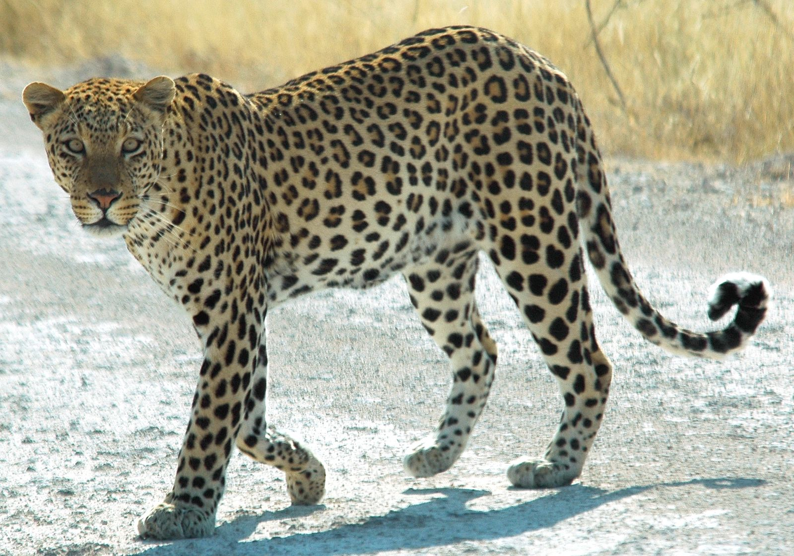
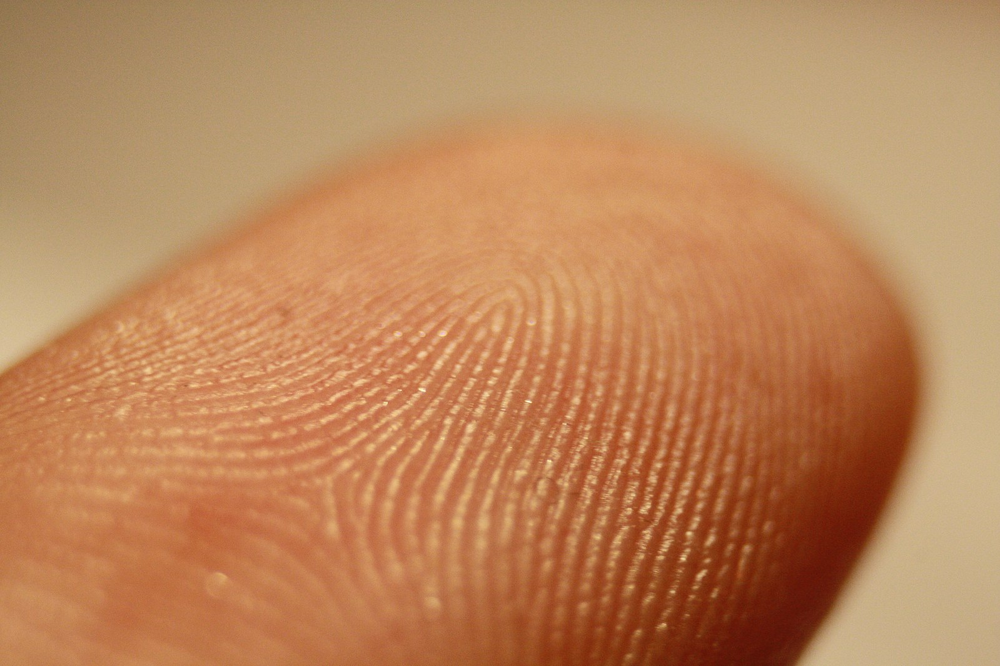
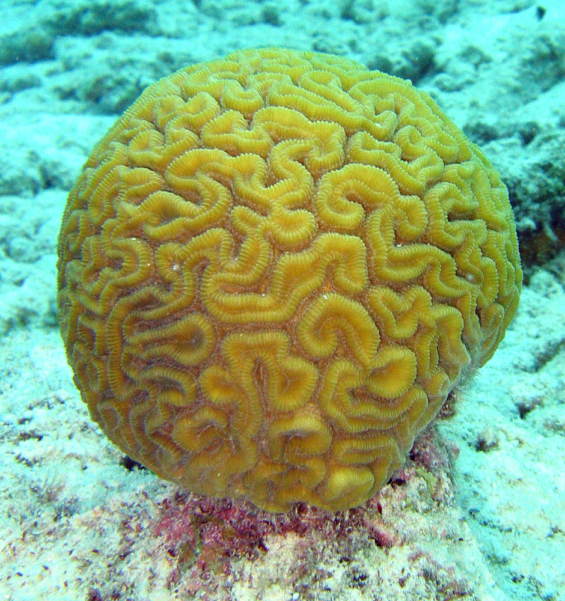
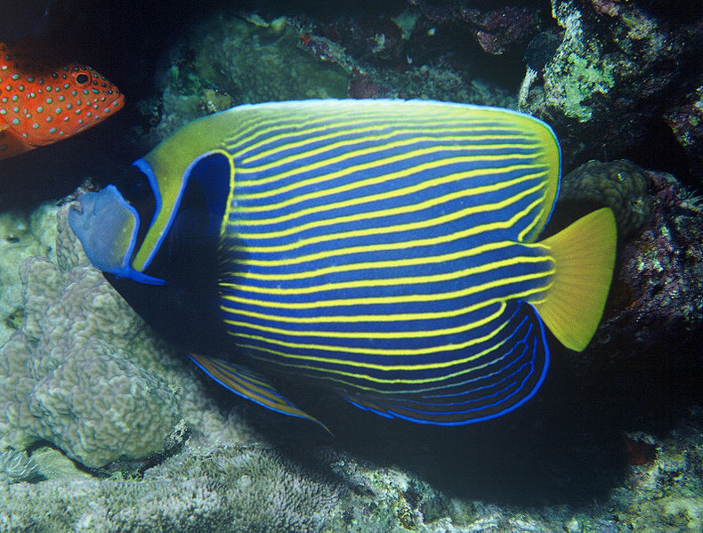

# 反応拡散方程式で 遊ぶ

千葉工業大学 上田 隆一

---

## 生物の作る模様

* なんでできるんだろう？　　　　　　　　　　　　　　 

 

左: Patrick Giraud (edited to fix white balance), CC BY-SA 3.0 <https://creativecommons.org/licenses/by-sa/3.0/>, via Wikimedia Commons. 中央左: Frettie, CC BY 3.0 <https://creativecommons.org/licenses/by/3.0>, via Wikimedia Commons. 中央右: released into the public domain by its author, Janderk at English Wikipedia. 右: released into the public domain by its author, Albert Kok at Dutch Wikipedia.

