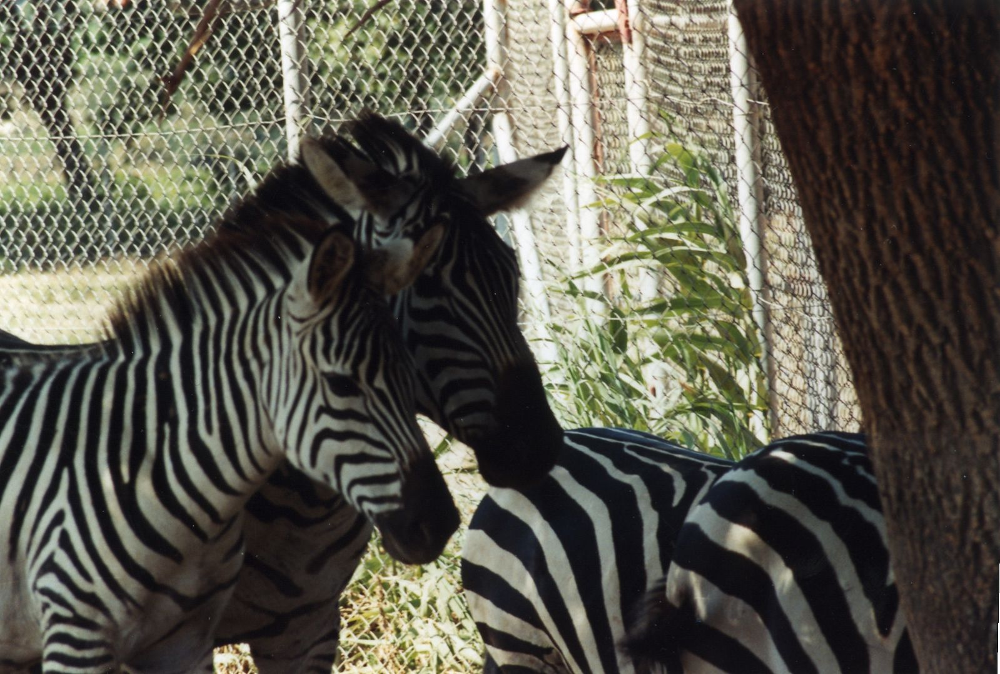

# 反応拡散方程式で 遊ぶ

千葉工業大学 上田 隆一

---

## 生物の作る模様

* ブチ、縞、渦巻きなど　　　　　　　　　　　　　　 

 

左: Patrick Giraud (edited to fix white balance), CC BY-SA 3.0 <https://creativecommons.org/licenses/by-sa/3.0/>, via Wikimedia Commons. 中央左: Frettie, CC BY 3.0 <https://creativecommons.org/licenses/by/3.0>, via Wikimedia Commons. 中央右: released into the public domain by its author, Janderk at English Wikipedia. 右: released into the public domain by its author, Albert Kok at Dutch Wikipedia.

---

## なぜ模様はできる？

* どこかに設計図？$\rightarrow$大雑把にはありそう
   * ヒョウは代々ヒョウ柄
   * 猫は個体差が大きいけど遺伝で模様が決まる 　
* 遺伝子の中に頭から足先までの設計図はなさそう
   * 偶然で決まる？
   * 偶然にしては整然としており、しかもどの部分も同じではない

Traroth, CC BY-SA 3.0 <https://creativecommons.org/licenses/by-sa/3.0/>, via <a href="https://commons.wikimedia.org/wiki/File:4_zebras,_r%C3%A9serve_africaine_de_Sigean.jpg">Wikimedia Commons.</a>

---

## どうやらこういうことらしい

（生物学者じゃないので伝聞形でお送りします）

* 何種類かの物質が次の２つの現象で互いに作用 $\rightarrow$模様が形成
  * 反応: ある場所で物質同士が反応すると、それぞれの物質の量が変わる
  * 拡散: 物質が多くなると周りに漏れて出る

  「反応拡散系」

---

## 反応拡散方程式の構成

* 2種類の物質で考えましょう
  * ある点のある時点の物質の濃度を$u, v$とする

