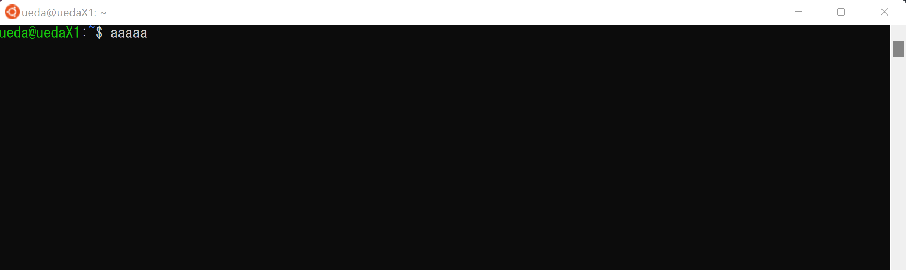
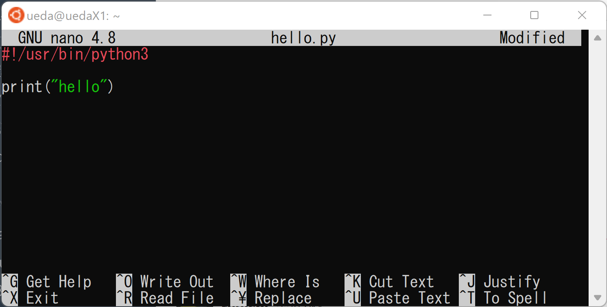

# ロボットシステム学

## 第1回: イントロダクション

千葉工業大学 上田 隆一

<br />

<p style="font-size:50%">
This work is licensed under a <a rel="license" href="http://creativecommons.org/licenses/by-sa/4.0/">Creative Commons Attribution-ShareAlike 4.0 International License</a>.
<a rel="license" href="http://creativecommons.org/licenses/by-sa/4.0/">
</a>
</p>

---

## 今日やること

* 講義の内容の理解（この動画）
* Linux環境の準備（別の資料か動画で）
* Linux環境を触る（この動画）

---

## 本講義の目的

* 最終目標
    * ROSを使いこなす<br />　
* 途中の目標（こちらの方が大切かも）
    * ROSの「下」や「周辺」を理解して使いこなす
        * プログラミング
        * 通信
        * OSの仕組み
        * ライセンス
        * オープンソース
        * Git/GitHub
        * テスト

---

## 各回の内容（第1〜6回）

* 第1回: イントロダクションと環境の準備
* 第2回: Linux環境でのPythonプログラミングI
* 第3回: Linux環境でのPythonプログラミングII
* 第4回: GitとGitHub
* 第5回: 著作権とライセンス
* 第6回: ソフトウェアのテスト

---

## 各回の内容（第7〜13回）

* 第7回: ROSのノードと通信の基本
* 第8回: ROSの通信と型
* 第9回: Pythonのクラスとオブジェクト
* 第10回: ROSシステムのテスト
* 第11回: 選択（動画を選んで視聴）
* 第12回: 選択（動画を選んで視聴）
* 第13回: まとめ

---

## 評価

* 課題x2: 20点ずつ（ボーナス点あり）
* テスト: 60点

---

## 参考文献（<span style="text-transform:none">Python</span>）

* はじめての人向け
    * 森 巧尚: Python 1年生 体験してわかる！会話でまなべる！プログラミングのしくみ, 翔泳社, 2017. <br />　
* そうでない人向け
    * 各個人のレベルによりけりなので特に指定しませんが、文法の解説が中心のもの
    * 企業のエンジニアやビジネスマン向けのような応用中心のものは回避を

---

## 参考文献（<span style="text-transform:none">Linux</span>）

* 上田, 山田, 田代, 中村, 今泉, 上杉: 1日1問, 半年以内に習得 シェル・ワンライナー160本ノック, 技術評論社, 2021. 
    * 自著ですがおすすめ。
    * 少しずつLinux（のコマンドライン）が使えるようになっていく構成になっています。後半は難しいです。

---

## <span style="text-transform:none">Linux</span>環境の準備

* Ubuntu（20.04 LTS or 22.04 LTSを標準とします）
    * 特殊なものは自己責任でご使用を<br />　
* ハードウェア（仮想マシン）環境
    * Windows Subsystem for Linux 2（WSL2）
    * PC
    * 仮想マシン
    * ラズパイ<br />　
* WSL2以外はGUI環境つきでインストール
    * 昨年度までと異なるので注意
    * 講義は昨年度までと同様CLI（コマンドラインインタフェース）中心

---

## <span style="text-transform:none">Linux</span>環境（CLI）を触る

* WSL（Windows）、Terminal（Mac, Linux）を立ち上げると字を打ち込める画面が出る
    * <span style="color:red">「端末（terminal）」</span>というもの



---

## 端末でなにをするか？

* 理系の大学生で想定される使用法
    * プログラムを書いて動かす（本講義で主に扱う）
    * レポートやプレゼン資料書き
    * ウェブサーバやファイルサーバを作る
    * 上記用途のためにソフトをセットアップしたり整備したり<br />　
* 慣れるとプログラミング以外でも便利に
    * しばらく端末で頑張ってみることを推奨
        * 不便もあるので、GUIと組み合わせて少しずつ

---

## はじめての端末とコマンド

* <span style="color:red">「コマンド（$\fallingdotseq$プログラム）」</span>を呼び出す
    * 例: <span style="color:red">`ls`</span>（ファイルのリスト表示プログラム）の呼び出し
```bash
WSL$ ls /mnt/c/Windows/
Ubuntu$ ls /etc/
```
    * GUIのアプリも立ち上げられる
```bash
### エクスプローラーを立ち上げる（上田の経験ではGUIより反応が良い）###
WSL$ explorer.exe
WSL$ explorer.exe .
### Ubuntuで特定のフォルダを開く###
Ubuntu$ nautilus /etc/
```
        * 最初はCLIでのファイル操作は難しいので、ストレスを感じたらGUIに逃げましょう。（最初から全部GUIはNG）

---

## ファイルとディレクトリ

* 普通の人が使うPC: フォルダの下にファイルや別のフォルダを置いてデータを整理
    * `nautilus`や`explorer.exe`で観察してみましょう<br />　
* Linuxの場合: 同じ
    * 見え方が違う
```bash
$ ls /mnt/c/
$ ls /etc/
```
    * `/`でフォルダやファイル名を区切ってファイルの場所を表す
        * <span style="color:red">「パス」</span>
        * 都道府県や市町村を`/`で区切って表現しているようなもの
        * 「フォルダ」は「<span style="color:red">ディレクトリ</span>」と呼ぶ

---

## コマンドの書き方

* 「名前 引数 引数 ...」と打ち込む
    * 例
```bash
$ ls /etc/            #lsに引数/etc/を与えて、/etc/のリストを表示
$ touch a.txt b.txt   #「touch」にa.txt、b.txtという文字列を与えてファイルを作成
$ ls                  #ファイルができているか確認（引数なしでlsを使用）
a.txt  b.txt
$ rm a.txt b.txt      #「rm」にファイル名を与えてファイルを削除
$ ls                  #lsするとa.txt、b.txtは消えている
```
        * <span style="color:red">`touch`</span>: ファイルがなければ新規作成、<span style="color:red">`rm`</span>: ファイルの削除<br />　
* コマンドもファイル
    * <span style="color:red">`which`</span>で確認可能
        ```bash
        $ which ls                #コマンドlsの由来は？
        /usr/bin/ls               #このファイル
        $ /usr/bin/ls /etc/       #ファイルを直接指定して実行
        （出力は省略）
        ```

---

## シェル

* 打ち込んだ文字列を解釈してコマンドを呼び出しているプログラムが存在
    * 「<span style="color:red">シェル</span>」という種類のプログラム
    * 今使っているのは「<span style="color:red">Bash</span>」という名前のプログラム<br />　
* コマンドを探しているのもシェル
    * `ls`とユーザが打つ$\rightarrow$`/usr/bin/ls`を探して実行
        * シェルの<span style="color:red">`PATH`</span>という変数に、探すべきディレクトリのリスト
        ```bash
        $ echo $PATH
        /usr/local/sbin:/usr/local/bin:/usr/sbin:/usr/bin:/sbin:/bin:/usr/games:/usr/local/games:/snap/bin
        ```
        * <span style="color:red">`echo`</span>: 引数で指定した文字列や変数を表示
        * 変数があるように、シェルはプログラム言語でもある


---

## ディレクトリの操作

* 使うコマンド
    * 移動: <span style="color:red">`cd`</span>、作成: <span style="color:red">`mkdir`</span>、削除: <span style="color:red">`rmdir`</span>、確認: <span style="color:red">`pwd`</span>

```bash
$ cd /etc/            <- /etc/に移動
$ cd ..               <- /etc/の上に移動（これより上には行けない「root」）
$ cd                  <- 「/home/ユーザ」に移動（ホームディレクトリ）
$ mkdir hoge          <- hogeというディレクトリを作成
$ cd ./hoge           <- 今作ったhogeに移動（「./」: 今いるディレクトリ）
$ pwd                 <- 今いるディレクトリのパスを確認
/home/ueda/hoge
$ cd ..
$ rmdir ./hoge        <- hogeを削除
```

---

## ファイルの作成

* <span style="color:red">エディタ</span>を使う
    * Windowsなら「メモ帳」（`notepad.exe`）、UbuntuのGUIなら`gedit`に相当<br />　
* 本当は<span style="color:red">Vim</span>を使ってほしいのですが、ここでは<span style="color:red">`nano`</span>で
    * 次ページ
    * Vimについては宿題

---

## <span style="text-transform:none">nano</span>を使う

* 手順
    1. <span style="color:red">`nano hello.py`</span>と端末に打ってエディタを立ち上げ
    2. 何か書いて保存（この例はPythonのコード）<br />
<br />
    3. 下の`^O`（Ctrl+O)で保存
        * `File Name to Write: hello.py`と聞かれるのでEnter
    4. `^X`（Ctrl+X）で終了


---

## ファイルができているか確認

* `ls`で<span style="color:red">ファイル</span>ができているか確認
* <span style="color:red">`cat`</span>で、書いた内容を確認

```bash
$ ls hello.py
hello.py
$ cat hello.py
#!/usr/bin/python3

print("hello")
```

---

## まとめ

* 今回の内容
    * イントロダクション
    * Linux環境の準備
    * ディレクトリの操作、ファイルの作成
        * 最初はGUIで。徐々にCLIに慣れること<br />　
* 重要語句
    * 端末（terminal）、コマンド、シェル、Bash、パス、`PATH`、ディレクトリ、エディタ、Vim、ファイル<br />　
* 出てきたコマンド
    * `ls`、`notepad.exe`、`nautilus`、`echo`、`touch`、`rm`、`cd`、`mkdir`、`rmdir`、`pwd`、`nano`、`cat`

---

## 宿題: エディタの<span style="text-transform:none">Vim</span>を<br />使えるようにする

* Vim練習コマンド`vimtutor`を実行
* 書いてある内容に従う
* `nano`で書いたものをVimで書いてみる
    * Vimを立ち上げるコマンド: `vi ファイル名`
    * ファイル名は変えましょう
