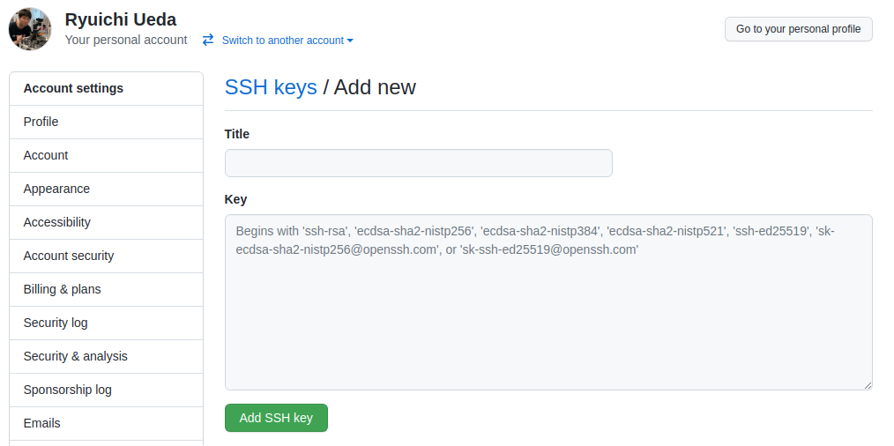

# ロボットシステム学

## 第4回: <span style="text-transform:none">GitとGitHub</span>

千葉工業大学 上田 隆一

<br />

<p style="font-size:50%">
This work is licensed under a <a rel="license" href="http://creativecommons.org/licenses/by-sa/4.0/">Creative Commons Attribution-ShareAlike 4.0 International License</a>.
<a rel="license" href="http://creativecommons.org/licenses/by-sa/4.0/">
</a>
</p>

---

## 今日やること

* GitとGitHubを使う
* Pythonの文法の勉強を少し<br />　
* 目次
    1. 準備
    2. GitHubへのコードの保存
    3. ブランチ
    4. その他リポジトリの操作


---

## 1. 準備

---

### <span style="text-transform:none">Git</span>

* 版管理（バージョン管理）システム
    * ファイルの変更履歴を管理するためのシステム
    * コードや文章を書くときは必須と言っても過言ではない<br />　
* Linus Torvalds が作成
    * Linuxの共同開発のため

---

### <span style="text-transform:none">Git</span>のインストール

* やること
    1. （`git`と打って「ない」と言われたら）インストール
        * `sudo apt install git`
        * 最近はデフォルトで使える環境が多い
    2. ユーザの設定

```bash
$ sudo apt install git
####自身の名前とe-mail アドレスを記録しておく###
$ git config --global user.name "Ryuichi Ueda"
$ git config --global user.email "ueda@hogehoge.com"
####エディタも登録しておくとよい###
$ git config --global core.editor vim
####確認###
$ cat .gitconfig
[user]
name = Ryuichi Ueda
email = ueda@hogehoge.com
[core]
editor = vim
```

---

### <span style="text-transform:none">GitHub</span>

* Gitを利用したサービス
    * 「リポジトリ」のホスティングと公開、コミュニケーション
        * <span style="color:red">リポジトリ</span>: あるソフトウェアに関するファイルの集まり
    * 公開しないリポジトリも作成可能<br />　
* 利用方法
    * ウェブサイト([https://github.co.jp/ ](https://github.co.jp/))
    * コマンドライン
        * `git`コマンド
        * `gh`コマンド（本講義では扱わず）

---

### <span style="text-transform:none">GitHub</span>でのアカウント作成

<span style="font-size:60%">注意: 文言等はよく変更されるので、基本的にサイトの英語を読んで手続きを</span>

1. トップページで"Sign up"か"GitHubに登録する"を押す
2. ユーザ名、email アドレス、パスワードを決めて<br />"Create account"を押す
    * ユーザ名は恥ずかしくないものを！
3. 画面指示に従って手続き
    * プランを選ぶときに"Free"が選択されているのを確認<br />$\rightarrow$"Finish sign up"
4. 登録したメールアドレスに確認メールが届く<br />$\rightarrow$指示にしたがう
5. 鍵の登録（次ページ）
6. （必要ならば）ファイアウォール対策

---

### 鍵の設定（鍵の作成）

* 手元のPCとGitHubとの通信を暗号化するために、<span style="color:red">公開鍵</span>をGitHubに登録
    * 手元のPCには<span style="color:red">秘密鍵</span>を持っておく
        * 秘密鍵は文字通り秘密にして他人に見せたり触れたりさせない<br />　
* 鍵の作り方
    ```bash
    $ ssh-keygen
    （いろいろ聞かれるけどすべてEnterで大丈夫）
    $ ls ~/.ssh/                   #確認
    id_rsa      id_rsa.pub         #この2つのファイルがあれば大丈夫
    ```
    * `id_rsa.pub`の方が公開鍵

---

### 鍵の設定（<span style="text-transform:none">GitHub</span>での作業）

* 右上のユーザのアイコンを押す$\rightarrow$Settings$\rightarrow$SSH and GPG keys$\rightarrow$New SSH key
    * titleはなんでもいいので鍵の名前を入れる
        * 例: 「WSL」とか「Ubuntu Note」とか
    * Keyに`id_rsa.pub`の中身を貼り付け
        * エディタや端末で開いてマウス等でコピーして貼り付け


---

### ファイアウォール回避の設定

* ホーム下の`.ssh/config`というファイルに次のように記述
    ```bash
    $ cat ~/.ssh/config
    ・・・
    
    Host github.com
          Hostname ssh.github.com
          User git
          Port 443
          IdentityFile ~/.ssh/id_rsa
    
    ・・・
    ```
    * SSHでデフォルトの22番ポートではなく<br />HTTPSの443番ポートを使う設定
        * 参考: https://docs.github.com/ja/authentication/troubleshooting-ssh/using-ssh-over-the-https-port


---

## 2. <span style="text-transform:none">GitHub</span>へのコードの保存

* やること
    * これまで講義で作ってきたコードをGitHubにアップロード
    * コードを消しちゃった人は前回の`plus_stdin`を作りましょう
        * `plus_stdin`
            ```python
            #!/usr/bin/python3
            import sys
               
            ans = 0.0
            for line in sys.stdin:
                ans += float(line)
                 
            print(ans)
            ```

---

### リポジトリの作成

GitHubに1つ作ってみましょう

* GitHubのサイトでの操作
  * 右上のアカウントのアイコン横の"+"マークを押して、<br />"New repository"を選択
  * 必要事項を記入
    * 名前: robosys202x
    * Description: 説明を適当に
    * Publicで
    * "Add a README file"にチェック
    * ライセンスは別の回で追加します
  * "Create repository"ボタンを押す
* ウェブ画面にリポジトリの画面
  * `README.md`がひとつ存在したリポジトリができる

---

### リポジトリを手元にコピー

* リポジトリの画面の"Code"をクリック
* "SSH"を選択してURLをコピー
  * クリップボードのアイコンをクリックするとコピーできる
* リポジトリをコピーしたいディレクトリで次の操作
    * この操作を<span style="color:red">クローン</span>と言う
        ```bash
        $ git clone <さっきクリップボードにコピーした文字列をペースト>
        Cloning into 'robosys2022'...
        remote: Enumerating objects: 3, done.
        remote: Counting objects: 100% (3/3), done.
        remote: Total 3 (delta 0), reused 0 (delta 0), pack-reused 0
        Receiving objects: 100% (3/3), done.
        $ cd robosys2022/
        $ ls -a
        .  ..  .git  README.md
        ```
    * <span style="color:red">注意: </span>鍵、`.git/config`の設定が失敗しているとエラー

---

### リポジトリにコードを追加<br />1: <span style="text-transform:none">git add</span>

* プログラム`plus_stdin`を一つ置く
    ```bash
    $ ls
    README.md  plus_stdin
    ```
* <span style="color:red">`git add`</span>で記録の対象として選択
    * <span style="color:red">ステージングエリア</span>というところに記録される
        ```bash
        $ git add plus_stdin
        $ git status             #ステージングエリアの確認
        ブランチ main
        Your branch is up to date with 'origin/main'.
        
        コミット予定の変更点:
          (use "git restore --staged <file>..." to unstage)
        	new file:   plus_stdin
        ```

---

### リポジトリにコードを追加<br />2: <span style="text-transform:none">git commit</span>

* <span style="color:red">`git commit`</span>でステージングエリアの情報をリポジトリに反映
    * この時点で、手元のリポジトリに`plus_stdin`の記録が残る
    * `git commit`で作った1つの記録を<span style="color:red">コミット</span>と呼ぶ
        ```bash
        $ git commit -m "Add a command" #git commit -m "何をしたか短く"
        [main fa8aab8] Add a command
         1 file changed, 8 insertions(+)
         create mode 100755 plus_stdin
        $ git log -n 1                 #最新のコミット1件を表示
        commit fa8aab8a2ade8cd33823f488fbb1bbec6d981260 (HEAD -> main)
        Author: Ryuichi Ueda <ryuichiueda@gmail.com>
        Date:   Tue Dec 7 16:58:54 2021 +0900
	　
            Add a command
        ```

---

### <span style="text-transform:none">GitHub</span>への反映

* 手元のリポジトリをGitHubのリポジトリへ転送
    * <span style="color:red">プッシュ</span>と呼ぶ
        * 手元（<span style="color:red">ローカルリポジトリ</span>からGitHub（<span style="color:red">リモートリポジトリ</span>）へ
    * コマンドは<span style="color:red">`git push`</span> 
        ```bash
        $ git push   #git push origin mainと打たないといけない場合もある
        Enumerating objects: 4, done.
        Counting objects: 100% (4/4), done.
        Delta compression using up to 16 threads
        Compressing objects: 100% (3/3), done.
        Writing objects: 100% (3/3), 373 bytes | 373.00 KiB/s, done.
        Total 3 (delta 0), reused 0 (delta 0)
        To github.com:ryuichiueda/robosys2022.git
           68d342f..fa8aab8  main -> main
        ```
    * プッシュしたらGitHub側で反映されたことを確認のこと

---

## 3. ブランチ

---

### <span style="text-transform:none">GitHub</span>を利用した開発

* GitHubにコードをアップした時点で様々な利点
    * 自分のコードを紛失する可能性が極めて低く
    * 混乱せずに様々な環境で開発可能に
    * 自分の力を見せることが可能に
        * たとえ学科内だと平凡でも、世の中的にはコードが書けるだけで少数派<br />　
* 面倒なこと: 少々責任が伴う
    * ライセンス等の整備（また別の回で）
    * <span style="color:red">使えないものを使えると言って置かない</span>
        * 他の人が使うかもしれない

---

### 動くものを残しながらの開発

* よくあるケース
    * 改良しようと結構手を加えたらコードが動かなくなった<br />　
* どうする？
    * そのままGitHubにpushすると他の人がコードを使えなくなる
    * GitHubにpushしないで放置すると作業の記録が残せない

<span style="color:red">$\Rightarrow$ブランチを分ける</span>

---

### ブランチ

* リポジトリの内容を枝分かれして開発を進める
  * ブランチ = 枝
* 今のところブランチは「main」だけ
  ```bash
  $ git branch
  * main          #ブランチはmainだけ。「*」は選択状態を表現
  ```
  * GitHubはmainブランチを優先して表示するので、ここでの雑な開発は避けたい
* 開発用ブランチを作りましょう
  ```bash
  $ git switch -c dev     #git checkout -b devでも可
  Switched to a new branch 'dev'
  $ git branch
  * dev               #devブランチができて、devが選択状態に
    main
  ```

---

### <span style="text-transform:none">dev</span>ブランチでの開発

ついでにPythonの文法の勉強

* やること1
    * `plus_stdin`について、整数の入力を整数に変換するよう改良
        * 注意: 改良じゃないかもしれません
        * <span style="color:red">例外処理</span>をしてみましょう
            * 失敗しそうな処理を<span style="color:red">`try`</span>で囲む
            * 下に<span style="color:red">`except`</span>のブロックを作って例外処理

<div style="font-size:80%">

```python
#!/usr/bin/python3
import sys
           　　 
ans = 0   #もともと0.0だったのを0に変更
for line in sys.stdin:
    try: 
        ans += int(line)   #intは文字列を整数に（失敗すると例外発生）
    except:
        ans += float(line)
           　 
print(ans)
```

</div>

---

### <span style="text-transform:none">dev</span>ブランチでの開発

* やること2
    * 検証とコミット（とプッシュ）　　　　　　　　　　　　　
        ```bash
        ###動作確認###
        $ seq 5 | ./plus_stdin 
        15                        #整数として処理されていることを確認
        $ seq 5 | sed 's/$/.1/' | ./plus_stdin 
        15.5                      #小数も計算できることを確認
        ###バグがないことを確認したらコミット###
        $ git add -A              #-Aで変更を全部ステージングできる
        $ git status              #ブランチと変更されたファイルを確認
        ブランチ dev
        コミット予定の変更点:
          (use "git restore --staged <file>..." to unstage)
        	modified:   plus_stdin
        $ git commit -m "Support integer only calculation"
        [dev f02a202] Support integer only calculation
         1 file changed, 5 insertions(+), 2 deletions(-)
        ###不要だけどGitHubにもプッシュしてみましょう###
        $ git push --set-upstream origin dev   #origin: GitHubにあるリポジトリのこと
	（略）
         * [new branch]      dev -> dev
        Branch 'dev' set up to track remote branch 'dev' from 'origin'.
        ```

---

### （寄り道）ブランチの観察

* `git log --graph`で表示してみましょう
    * 読み取れること
        * 各コミットは直列な関係にある
            * 最初のコミット->mainでのコマンド追加->devでの機能追加
    * 読み方
        * 各コミットには`f02a2023...`のような番号がついている
            * <span style="color:red">コミットハッシュ値</span>
        * ()の中にブランチ名
            * `HEAD`: いまのディレクトリの内容を指す
            * `origin/<ブランチ名>`: GitHubのリポジトリのブランチ
                ```
                $ git log --graph
                * commit f02a20237590c9e4650f100928c6c2f969c111c3 (HEAD -> dev, origin/dev)
                |（略）
                |     Support integer only calculation
                |
                * commit fa8aab8a2ade8cd33823f488fbb1bbec6d981260 (origin/main, origin/HEAD, main)
                |（略）
                |     Add a command
                |
                * commit 68d342fbb7a9b65e402d0b6f5a7763e56f248937
                （略）
                      Initial commit
                ```

---

### <span style="text-transform:none">dev</span>ブランチでの開発

* やること3: mainへの<span style="color:red">マージ</span>とGitHubへのプッシュ
    * まずmainブランチに戻って変更内容の確認
        ```bash
        $ git switch main        # git checkout mainでも可
        Switched to branch 'main'
        Your branch is up to date with 'origin/main'.
        $ git diff main dev
        （略。mainとdevのコードの違いが表示される）
        ```
    * mainにdevの中身をマージ（併合）してGitHubに反映
        ```bash
        $ git merge dev
        Updating fa8aab8..f02a202
        Fast-forward
         plus_stdin | 7 +++++--
         1 file changed, 5 insertions(+), 2 deletions(-)
        $ cat plus_stdin 
        （略。例外処理の入ったコードが表示される。）
        $ git push
        Total 0 (delta 0), reused 0 (delta 0)
        To github.com:ryuichiueda/robosys2022.git
           fa8aab8..f02a202  main -> main
        ```
* 安全にmainブランチを更新できた


---

## 4. その他リポジトリの操作

---

### 過去のコードの取り出し（動機）

* 昔のコードを一部復活させたいときにやりたくなる
    * 例: 次の履歴から「Add a command」時のコードを取り出したい
        ```bash
        $ git log 
        commit f02a20237590c9e4650f100928c6c2f969c111c3 (HEAD -> main, origin/main, origin/HEAD)
        （略）
            Support integer only calculation
        　
        commit fa8aab8a2ade8cd33823f488fbb1bbec6d981260   #これの`plus_stdin`を取り出したい
        （略）
            Add a command
        　
        commit 68d342fbb7a9b65e402d0b6f5a7763e56f248937
        （略）
            Initial commit
        ```

---

### 過去のコードの取り出し（方法）

* 取り出すだけなら次の方法で可能　　　　　　　　　
    ```bash
    $ git switch -d fa8aab8         #コミットハッシュ値の先頭何桁を指定
    HEAD is now at fa8aab8 Add a command
    $ git branch
    * (HEAD detached at fa8aab8)            #使い捨てのブランチができる
      dev
      main
    $ cat plus_stdin 
    （略。try、exceptを加える前のコード）
    $ cp plus_stdin /tmp/                 #必要ならコードのコピーをとる
    $ git switch -                                            #元に戻る
    Previous HEAD position was fa8aab8 Add a command
    Switched to branch 'main'
    Your branch is up to date with 'origin/main'.
    ```

---

### コンフリクト

* Gitを使っていると、コミット同士が矛盾することがある
    * マージできない<br />　

そういう状況を作ってみましょう。

---

### コンフリクトを起こす（準備）

* ローカルリポジトリを別に作成
    ```bash
    $ mkdir ~/tmp/
    $ cd ~/tmp/
    $ git clone git@（略） #略の部分は自分で考えましょう
    ```
    * ローカルリポジトリが2個に　　　　　　　　　　　　　　　　　　
        * 片方をA、もう片方をBと呼びましょう
            * どっちがどっちでもよい


---

### コンフリクトを起こす（その1）

* リポジトリAで変更してpush
    * 数字の処理部分を関数に
        * Pythonの関数の定義は初出　　　　　　　　　　　　　
        ```python
        #!/usr/bin/python3
        import sys
        　 
        　 
        def tonum(s):   #def 関数の名前(引数)で関数を定義
            try:
                return int(s)
            except:
                return float(s)
        　 
        　 
        ans = 0
        for line in sys.stdin:
                ans += tonum(line)
        　 
        print(ans)
        ```
        * <span style="color:red">忘れずpushを</span>


---

### コンフリクトを起こす（その2）

* リポジトリBで別の変更
    * リポジトリAの存在を忘れて作業したという状況
        ```python
       （略）
        for line in sys.stdin:
            line = line.rstrip() #for文の下にこの行を挿入
       （以下略）
        ```
    * コミットしてpushするとエラー
        ```bash
        $ git push 
        To github.com:ryuichiueda/robosys2022
         ! [rejected]        main -> main (non-fast-forward)
        error: failed to push some refs to 'git@github.com:ryuichiueda/robosys2022'
        hint: Updates were rejected because the tip of your current branch is behind
        hint: its remote counterpart. Integrate the remote changes (e.g.
        hint: 'git pull ...') before pushing again.
        hint: See the 'Note about fast-forwards' in 'git push --help' for details.
        ```

異なる内容はpushして混ぜることができない


---

### コンフリクトの解消（その1）

* リポジトリBで`git pull`
    ```bash
    $ git pull
    Auto-merging plus_stdin
    CONFLICT (content): Merge conflict in plus_stdin
    Automatic merge failed; fix conflicts and then commit the result.
    ```
    * 「`CONFLICT`」と出るが`pull`は完了　　　　　　　　　　　
        ```python
	#!/usr/bin/python3
        import sys
        
        <<<<<<< HEAD                #これがローカルの最新コミット内容
        ans = 0
        for line in sys.stdin:
            line = line.rstrip()
        =======                     #a493...までがリモートの最新内容
        
        def tonum(s):
        >>>>>>> a4936f439aed64b3234d533c6e7a3abc7b5d744d
            try:
                return int(s)
        ```
        * （この例はかなり乱れているが）A, B両方の更新を反映


---

### コンフリクトの解消（その2）

* コードを手で修正してコミット、push
    ```python
    #!/usr/bin/python3
    import sys 
    　
    　
    def tonum(s):
        try:
            return int(s)
        except:
            return float(s)
    　
    
    ans = 0 
    for line in sys.stdin:
        line = line.rstrip()
        ans += tonum(line)
    　
    print(ans)
    ```

---

### その他の操作

* ローカルリポジトリだけ作ったものをGitHubにアップ
    * 手順
        1. GitHubに同名のリポジトリを作成
        2. `git remote add origin <リポジトリ>`で結びつけ
    * 注意: メインのブランチをローカルとリモートで合わせること
        * 手元が`master`なのに、リモートが`main`のときは手元を`main`にするとよい<br />　
* リポジトリの名前を変えたい
    * リモート: GitHubのリポジトリのSettingsで変更
    * ローカル: リポジトリの`.git/config`を編集
        * 実は変えなくてもリモートにpush可能

