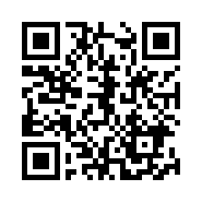

# ロボットシステム学

## 第5回: 著作権とライセンス

千葉工業大学 上田 隆一

 

This work is licensed under a <a rel="license" href="http://creativecommons.org/licenses/by-sa/4.0/">Creative Commons Attribution-ShareAlike 4.0 International License</a>.

---

## 今日やること

* ライセンスと著作権について理解
    * 込み入った話ではなくて基礎の基礎
    * ↓ 込み入った話については2021年度までの動画を 

* GitHubのリポジトリのコードに 著作権やライセンスを設定

---

## 1. 著作権について

---

### 著作権の基本

* あたりまえですが
    * 他人の作った文章や絵、写真やその他著作物を 勝手にコピーしてはいけません
    * 食品などと同じで、盗む人がいると作った人が バカを見るので保護されるべき

* でも・・・
    * 我々は本当に守れているだろうか？
    * 例外はないだろうか？

---

### 本科目の課題提出で見られる光景1

コードを書いてGitHubに公開するのですが・・・

* ちゃんと手続きをとらずに人のコードをコピー
    * たとえ1行でも泥棒です！ （実は今回後半で出てくる手続きでコピー可に）
    * 自分で作り出さずにタダ乗りすれば課題は0点

---

### 本科目の課題提出で見られる光景2

* 自分の著作と主張していない状態で、仲間や他人に自分のコードを写させる/写される
    * 自分で書いたことを主張していない時点で課題は0点
        * たとえ被害者であっても0点になることも
    * 仲間に不正をさせたら0点どころか失格 　
* 「信じてください」は通用しない
    * 何かあったときに提示するために、客観的な証拠を残していく
        * GitHubにいつpushしたか等
    * 正しく手続きする
        * しかるべき表記で自身の著作であると主張
        * しかるべき表記で仲間にコードを提供/仲間が著作者を表示
