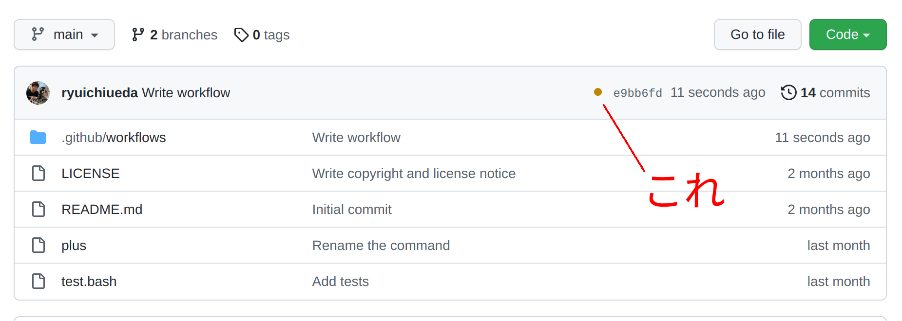
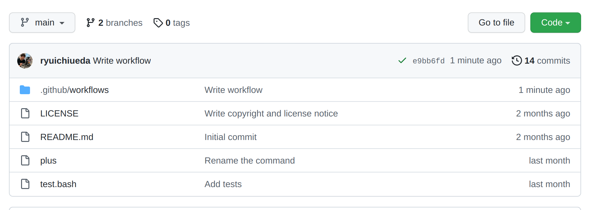
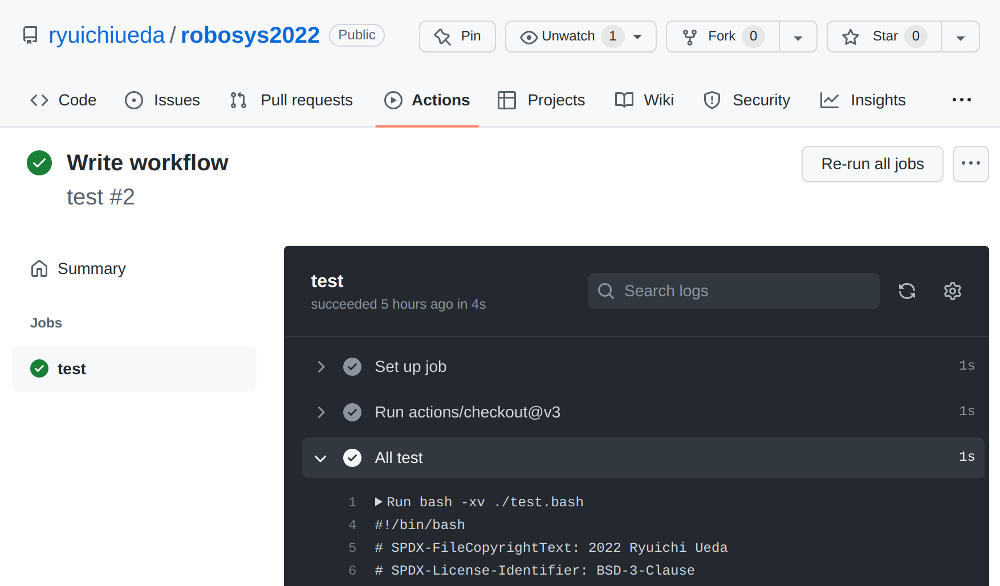
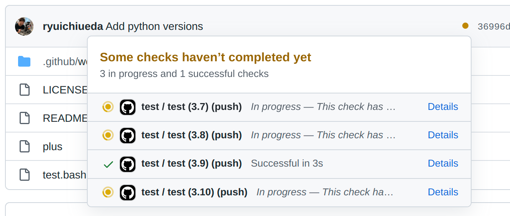
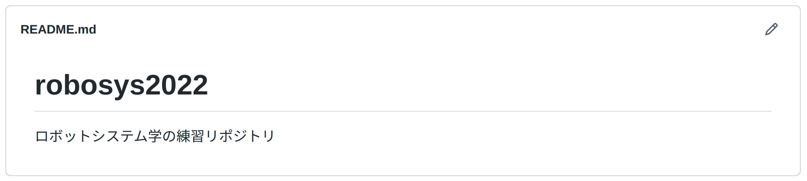
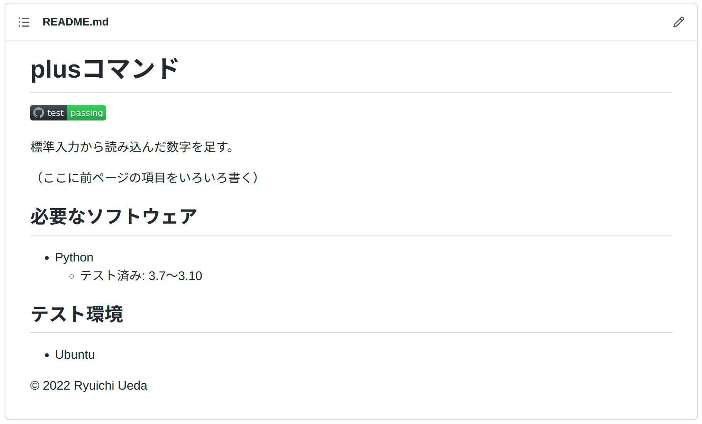

# ロボットシステム学

## 第7回: <span style="text-transform:none">GitHub</span>でのテスト

千葉工業大学 上田 隆一

<br />

<p style="font-size:50%">
This work is licensed under a <a rel="license" href="http://creativecommons.org/licenses/by-sa/4.0/">Creative Commons Attribution-ShareAlike 4.0 International License</a>.
<a rel="license" href="http://creativecommons.org/licenses/by-sa/4.0/">
</a>
</p>

---

## 今日やること

* 1. GitHub Actions
* 2. READMEの整備

---

## 1. <span style="text-transform:none">GitHub Actions</span>

---

### ソフトウェアのテスト

* 前回体験
  * 自分で使うソフトウェアならこれくらいで十分<br />　
* 仕事や人の使うソフトウェアの場合は？
  * 様々な環境に対応する必要性
    * Pythonのバージョン
    * Linuxだけじゃなく、他のOSは？
    * 自分の使っている環境（いろんなものが既にインストール済み）以外
  * 常に動作しているものが存在
    * 止めないでどうやって開発したものをマージするのか
  * ちゃんとテストしていると示したい

---

### テストが（も）できるウェブサービス

* そういうものが存在
  * [CircleCI](https://circleci.com/ja/)
  * [Travis CI](https://www.travis-ci.com/)
  * ・・・<br />　
* 基本的な動作
  1. GitHub等にpushされたコードをテスト
    * GitHub等のページに結果が表示されるように手配
  2. テストが通ったら次のアクションに
    * リリースしてユーザーが利用可能に
    * あるいは<span style="color:red">動いている本番のシステムに反映</span>


---

### 改めてテストの役割

* 抜け目のないテストにより
  * デバッグやリリースの際の手間の削減が可能
  * 「動いているシステムは怖くていじれない」からの脱却
    * 「継続的インテグレーション（CI）」「継続的デリバリー（CD）」<br />「継続的デプロイ」
    * CircleCIやTravis CIのサービス（<span style="color:red">CI/CDサービス</span>）のテスト機能: CIやCDを実現するためのもの<br />　
* <span style="color:red">「自動」でテストできることがキモ</span>
  * 自動化の仕組み: テストの終了ステータスが0<br />$\rightarrow$自動化のプログラムを起動

---

### <span style="text-transform:none">GitHub Actions</span>

* GitHubのCI/CDサービス
  * CircleCIやTravis CIより後発だが、GitHubにくっついていて使いやすいため、この講義で利用
  * テストをするときの使い方
    * リポジトリに`.github/workflows`というディレクトリを作成
    * その中に$\circ\circ$`.yml`というファイル（ワークフローファイル）を作成
      * とりあえず`test.yml`で
    * テストの手続きを記述（次ページ）
 ```bash
$ mkdir .github    #robosys2022のリポジトリのトップディレクトリで
$ cd .github/      #.githubディレクトリは隠れディレクトリになるので注意（lsで出てこない。ls -aで出る。）
$ mkdir workflows
$ cd workflows/
$ touch test.yml   #「./robosys2022/.github/workflows/test.yml」ができているとOK
 ```

---

### テストの手続きの記述

* 下の例のように記述
  * YAML（YAML Ain't a Markup Language）形式
    * データをテキストファイルに記述するときに使われる形式のひとつ
      * ROSでも随所に利用される。
    * インデントは半角空白2つが基本
      * 「キー: 値」でデータを作る。インデントされているものは全体が値
      * 「`-`」は配列の要素

```yaml
  name: test        #name: ワークフローの名前
  on: push          #on: いつこのワークフローを走らせるか
  jobs:             #走らせたい処理（ジョブ）のリスト
    test:           #testというジョブを作る
      runs-on: ubuntu-latest   #どの環境で動かすか
      steps:                   #手続きの記述
      - uses: actions/checkout@v3  #https://github.com/actions/checkoutのバージョン3を使用
      - name: All test             #このジョブの名前
        run: bash -xv ./test.bash  #テストのシェルスクリプトを走らせる
```

---

### <span style="text-transform:none">push</span>$\rightarrow$ワークフローの自動実行

* リポジトリのページに小さな記号
  * <span style="color:orange">$\bullet$</span>: 実行中、<span style="color:green">$\checkmark$</span>: テスト成功、<span style="color:red">$\times$</span>: テスト失敗<br />

* 記号を左クリックすると小窓が出現
  * 「Details」を押してみましょう。<br />


---

### ワークフローのログ確認

* Detailsを押すと行われた処理のシェルの出力が閲覧可能
  * 「All test」をクリックすると`test.bash`のログ

* 全項目の終了ステータスが0なら<span style="color:green">$\checkmark$</span>の表示

---

### 複数バージョンの<span style="text-transform:none">Python</span>を試す

* ジョブに`strategy/matrix/python-version`を追加
  ```yaml
  ・・・
  jobs:
    test:
      runs-on: ubuntu-latest
      strategy:
        matrix:
          python-version: ["3.7", "3.8", "3.9", "3.10"]
      steps:
        ・・・
  ```
  * 実行してみると、全バージョンに対してテストが走る


---

## 2. READMEの整備

* README: このソフトを使ってもらうときに最初に読んでもらうドキュメント
  * 練習リポジトリの中ある`README.md`がソレ
  ```markdown
  # robosys2022
  ロボットシステム学の練習リポジトリ
  ```
    * Markdownという形式で記述
  * GitHubだとこのように表示される<br />
    * 今のところ不親切


---

### READMEに書くこと

* 全て書く必要はないが、ユーザが困らないように（[例](https://github.com/ryuichiueda/GlueLang)）
  * 何をするためのソフトか
  * 使い方
    * ダウンロード、インストール、起動する手順、簡単な使い方
  * どんな環境で使えるか
    * OS/Pythonのバージョン/他に必要なソフトウェアやライブラリ
  * テストの結果（後述）
  * 権利関係・謝辞
    * 著作権、ライセンス（利用しているソフトウェアについても）
    * 手伝ってくれた人のリストと手伝いの中身
  * その他必要なこと

---

### テスト結果やテストに対する記述


* README.mdの例
  ```md
  # plusコマンド
  
  ↑ テスト結果を反映したバッジの画像が埋め込まれる。（ryuichiueda等は各自変更を。）
  
  標準入力から読み込んだ数字を足す。
  
  （ここに前ページの項目をいろいろ書く）
  
  ## 必要なソフトウェア
  * Python
    * テスト済み: 3.7〜3.10

  ## テスト環境
  * Ubuntu

  © 2022 Ryuichi Ueda
  ```

---

### <span style="text-transform:none">GitHub</span>上での表示




---

## まとめ

* CI/CDサービスのひとつを利用
  * pushしたときに自動でテスト$\rightarrow$結果を表示
    * ユーザに状況を伝達
  * 終了ステータスを利用
    * 最新のサービスでも基本的な仕組みに依存<br />　
* READMEの整備
  * リポジトリのソフトを安心して広く使ってもらうために必須
  * ある程度フォーマットは決まっているものの、<br />ユーザへの気配り重視で記述しましょう。
