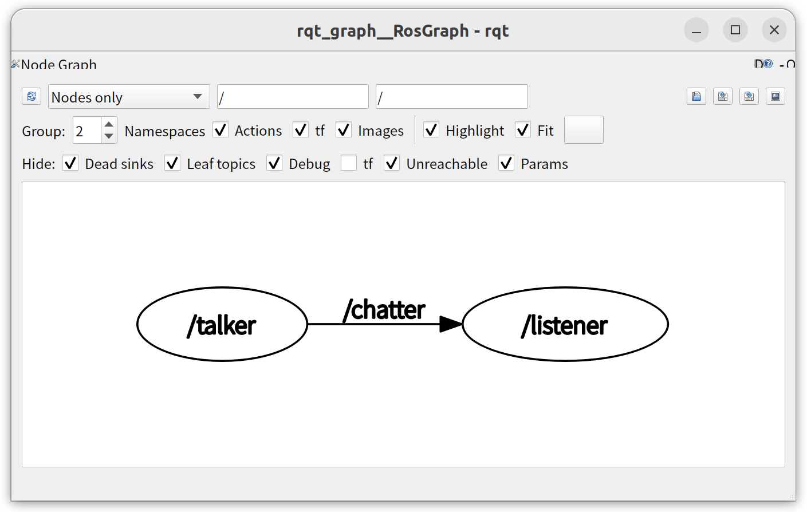

# ロボットシステム学

## 第8回: <span style="text-transform:none">Robot Operating System (ROS2)</span>

千葉工業大学 上田 隆一

<br />

<p style="font-size:50%">
This work is licensed under a <a rel="license" href="http://creativecommons.org/licenses/by-sa/4.0/">Creative Commons Attribution-ShareAlike 4.0 International License</a>.
<a rel="license" href="http://creativecommons.org/licenses/by-sa/4.0/">
</a>
</p>

---

## 今日やること

* ROS2
* 参考図書
    * 近藤 豊: [ROS2ではじめよう 次世代ロボットプログラミング](https://gihyo.jp/book/2019/978-4-297-10742-0), 技術評論社, 2019. 
    * 岡田 浩之: [ロボットプログラミングROS2入門 ](https://www.it-book.co.jp/books/107.html), 科学情報出版, 2020. <br />　
* この講義では使えるようになるのが目標
    * 難しい話はしません
    * やること
        * インストール
        * パッケージ作成

---

## <span style="text-transform:none">ROS: robot operating system

* ロボットのソフトウェアコンポーネントを作って動作させるためのフレームワーク/ミドルウェア
  * OSでは無い
* 発祥: 2000年代後半、Willow Garage社
* BSDライセンス
* サイト
  * 公式ページ: https://www.ros.org/
  * マニュアル等: https://docs.ros.org/

---

## どんなものか

* 本体: プロセス間通信をつかさどる
  * プロセス同士をpublish-subscribeモデルや<br />client-serverモデルでつなぐ
  * 通信するデータに型<br />　
* 周辺
  * ビルドシステム、パッケージ管理、テストツール、・・・

<span style="color:red;font-size:70%">と書いてもよくわからんので使うメリットから</span>

---

## ROS化されている<br />重要なソフトウェア

* 移動ロボットの制御ソフトウェア
  * gmapping, cartographer, ナビゲーションメタパッケージ
    * 地図生成（次のページにデモ）、位置推定、経路生成<br />　
* マニピュレータのソフトウェア
  * MoveIt!
    * 腕の動作計画 腕先の位置を入力→関節角を計算（逆運動学）<br />　
* 各種センサのインタフェース
  * すぐ使える
  * 以前は（特にLinuxでは）自分でシリアル通信のプログラムを書くなどの苦労があった

---

## ROSを使ったSLAMの応用例

* コントローラでロボットに移動経路を教え、<br />そのあとロボットが自律で経路を移動
    * 移動経路を教えているときにロボットは<br />SLAMで地図を作り、通った位置を記録

<iframe width="560" height="315" src="https://www.youtube.com/embed/eVHkHOCsHns" frameborder="0" allow="accelerometer; autoplay; encrypted-media; gyroscope; picture-in-picture" allowfullscreen></iframe>

* ポイント: SLAMのコードは一切書いてない

---

## ROSを使った<br />マニピュレーションの様子

* https://twitter.com/i/status/1201399538541400064
  * 2年生有志作
  * 動きはMoveIt!が生成
    * 自分で計算しなくていい（教員苦笑い）

---

## ROSのバージョン

* ROS1（もともとROSと呼ばれていたもの）
  * オリジナルのROS
  * 主に研究のフレームワークとして発達
  * まだまだ使われる/研究室でも使う
    * 習得は2021年までの講義資料でどうぞ（https://youtu.be/PL85Pw_zQH0 ）<br />　
* ROS2（今回扱うもの）
  * ROSが普及して、当初想定していなかった利用場面が増加
    * セキュリティー、製品化、シビアな通信環境、・・・
  * アーキテクチャから作り直し
    * ROS1とは基本的に互換性なし

---

## ROS2のインストールの準備

* ROS1がすでにインストールされている場合
  * 方法1: 別の環境を準備する
  * 方法2:
    * `.bashrc`から関係する記述をコメントアウト
    * ターミナルを出る

```bash
$ vi ~/.bashrc
（略）
#source /opt/ros/noetic/setup.bash     ←ここから関係する設定をコメントアウト
#source ~/catkin_ws/devel/setup.bash
#export ROS_MASTER_URI=http://localhost:11311
#export ROS_HOSTNAME=localhost
```

---

## ROS2のインストール

* [インストールスクリプト](https://github.com/ryuichiueda/ros2_setup_scripts/blob/master/setup.bash)
    * 手順は次の通り
    * 余計なものを入れたくない場合は`setup.bash`の`ros-${ROS_VER}-desktop`を`ros-${ROS_VER}-ros-base`に変更して実行

```bash
$ git clone https://github.com/ryuichiueda/ros2_setup_scripts
$ cd ros2_setup_scripts
$ ./setup.bash
$ source ~/.bashrc
### 動作確認 ###
$ ros2
usage: ros2 [-h] Call `ros2 <command> -h` for more detailed usage. ...

ros2 is an extensible command-line tool for ROS 2.
（以下略）
```

---

## 動作確認

* ひとつプログラムを立ち上げ
  ```bash
  端末1$ ros2 run demo_nodes_py talker
  ・・・
  [INFO] [talker]: Publishing: "Hello World: 61"
  [INFO] [talker]: Publishing: "Hello World: 62"
  ・・・
  ```
  * 「"Hello World: 数字"を発行」と言っている
* もうひとつプログラムを立ち上げ
```bash
端末2$ ros2 run demo_nodes_py listener
・・・
[INFO] [listener]: I heard: [Hello World: 55]
[INFO] [listener]: I heard: [Hello World: 56]
・・・
```
  * 「"Hello World: 数字"を聞いた」と言っている

で、これは何をしているのか？

---

## ROSの通信

* 基本1: プログラムのことを「ノードと呼ぶ」
* 基本2: ノードは互いに通信する<br />　
* これで何ができるか？
  * ロボットの各機能を別のプログラムとして実装できる
    * 例1: 画像処理のプログラムとナビゲーションのプログラムの連携
      * 画像処理のプログラムは独立したソフトウェアとして公開可能
    * 例2: レーザースキャナをA社からB社に交換
      * A社とB社が同じ出力をするノードを作っていると、交換が容易

---

## 通信の様子

* 別々の端末で3つのプログラムを実行
  * GUIのツールを使える人だけ
    ```bash
    端末1$ ros2 run demo_nodes_py talker
    端末2$ ros2 run demo_nodes_py listener
    端末3$ ros2 run rqt_graph rqt_graph
    ```



---

## ROS2のノードを作成

Pythonのものを作ってみましょう（[参考](https://index.ros.org/doc/ros2/Tutorials/Developing-a-ROS-2-Package/#python-packages)）

* これからやること
    * ワークスペースを作る 
    * 初期状態のパッケージを作る
    * パッケージ情報の記述
    * パッケージのビルド
    * パブリッシャの実装
    * サブスクライバの実装
    * ローンチファイルの実装


---

## ワークスペースの作成

* ワークスペース: 作業場
* とりあえずディレクトリを作るだけ

```bash
$ mkdir -p ros2_ws/src
$ tree ros2_ws/
ros2_ws/
└── src
1 directory, 0 files
```

---

## 初期状態のパッケージを作る

* パッケージ: ROSのプログラムの配布単位
    * GitHubのリポジトリにほぼ相当
    * なかにいくつかのノードのプログラムを入れる
    * `ros2 pkg create`を使う
      * 下の例: mypkgというパッケージを作成
        ```bash
        $ cd ~/ros2_ws/src/
        $ ros2 pkg create mypkg --build-type ament_python
        going to create a new package
        package name: mypkg
        ・・・
        $ tree
        .
        └── mypkg
            ├── mypkg
            │   └── __init__.py
            ├── package.xml
            ├── resource
            │   └── mypkg
            ├── setup.cfg
            ├── setup.py
            └── test
                ├── test_copyright.py
                ├── test_flake8.py
                └── test_pep257.py
        4 directories, 8 files
        ```

---

## パッケージ情報の記述1

* `package.xml`を編集する
    * パッケージマニフェストというもの
    * パッケージの情報を記述したファイル
        * 説明（description）、メンテナ、ライセンスをちゃんと書く

```
$ head package.xml
<?xml version="1.0"?>
<?xml-model href="http://download.ros.org/..."?>
<package format="3">
  <name>mypkg</name>
  <version>0.0.0</version>
  <description>a package for practice</description>
  <maintainer email="ryuichiueda@example.com">Ryuichi Ueda</maintainer>
  <license>BSD</license>

  <test_depend>ament_copyright</test_depend>
・・・
```

---

## パッケージ情報の記述2

* `setup.py`の編集
    * Pythonのモジュールで使われるインストールスクリプト
        * 変更箇所は`package.xml`と同じ

```
$ cat setup.py
from setuptools import setup

package_name = 'mypkg'

setup(
    name=package_name,
    version='0.0.0',
    ・・・
    maintainer='Ryuichi Ueda',
    maintainer_email='ryuichiueda@gmail.com',
    description='a package for practice',
    license='BSD',
・・・
```

---

## パッケージのビルド

```bash
### ビルド ###
$ cd ~/ros2_ws/
$ colcon build
Starting >>> mypkg
Finished <<< mypkg [2.46s]

Summary: 1 package finished [2.97s]
### パスを通す ###
$ source install/setup.bash
$ source install/local_setup.bash
### パスが通っているか確認 ###
$ ros2 pkg list | grep mypkg
mypkg

```

---

## パブリッシャの作成

* ミニマムなものを書いてみる
    * スクリプトの置き場は`~/ros2_ws/src/mypkg/mypkg`
    * 参考にしたページ
        * [パブリッシャの書き方](https://index.ros.org/doc/ros2/Tutorials/Writing-A-Simple-Py-Publisher-And-Subscriber/#write-the-publisher-node)
        * [クラスなしで記述する方法](https://qiita.com/l1sum/items/b7393c34fb0127826f74)
* コードの前半（`talker.py`）

```python
  1 import rclpy
  2 from rclpy.node import Node
  3 from std_msgs.msg import Int16
  4
  5 rclpy.init()
  6 node = Node("talker")                               #ノード作成
  7 pub = node.create_publisher(Int16, "countup", 10)   #パブリッシャ作成
  8 n = 0 #カウント用変数
  9
```
（下に続く）

>>>

* コードの後半

```python
 10 def cb():                  #定期的に呼ぶコールバック関数
 11     global n
 12     msg = Int16()
 13     msg.data = n
 14     pub.publish(msg)
 15     n += 1
 16
 17 node.create_timer(0.5, cb)  #タイマー設定
 18 rclpy.spin(node)            #実行（無限ループ）
```

---

## パッケージの設定と実行

* パッケージに`talker.py`や依存するモジュールを登録
    * `package.xml`に利用するモジュールを登録
```
・・・
  <license>BSD</license>
  <exec_depend>rclpy</exec_depend>
  <exec_depend>std_msgs</exec_depend>
・・・
```
    * `setup.py`にスクリプト（正確にはエントリポイント）を登録
```python
・・・
        entry_points={
        'console_scripts': [
            'talker = mypkg.talker:main',
            #'listener = mypkg.listener:main', ←あとからコメントアウト
        ],
・・・
```

* 実行（下のスライド）

>>>

```
$ chmod +x talker.py
### 依存関係の確認 ###
$ cd ~/ros2_ws
$ sudo rosdep install -i --from-path src --rosdistro foxy -y
### ビルド ###
$ colcon build
Starting >>> mypkg
Finished <<< mypkg [2.55s]

Summary: 1 package finished [3.06s]
### インストール ###
$ . install/setup.bash
### 実行 ###
$ ros2 run mypkg talker
（なにも表示されない）
```

```
### 別の端末でサブスクライブする ###
$ ros2 topic echo /countup
data: 13
---
data: 14
---
・・・
```

---

## サブスクライバの記述

* これはクラスを使って作ってみましょう（`listener.py`）
```python
  1 import rclpy
  2 from rclpy.node import Node
  3 from std_msgs.msg import Int16
  4
  5 class ListenerNode(Node): #Nodeクラスの継承
  6
  7     def __init__(self): #初期化
  8         super().__init__("Listener")
  9         self.create_subscription(Int16, "countup", self.cb, 10)
 10
 11     def cb(self, msg):
 12         self.get_logger().info("Listen: %d" % msg.data)
 13
 14 rclpy.init()
 15 rclpy.spin( ListenerNode() ) #ノードをspinにしかける
```

---

## <span style="text-transform:none">talker</span>と<span style="text-transform:none">listener</span>の実行

```
### setup.pyへの記述やビルドの手続きを済ませておく ###
端末1$ ros2 run mypkg talker
端末2$ ros2 run mypkg listener
[INFO] [Listener]: Listen: 142
[INFO] [Listener]: Listen: 143
・・・
```

---

## ローンチファイル（準備）

* ROS2ではPythonで記述
* 準備
    * ディレクトリを作成
```
$ cd ~/ros2_ws/src/mypkg/
$ mkdir launch
```
    * `setup.py`にローンチファイルの場所を記述
```
  2 import os
  3 from glob import glob
（中略）
 11     data_files=[
（中略）
 15        (os.path.join('share', package_name), glob('launch/*.launch.py'))
 16     ],
```
    * `package.xml`に依存関係を記述
```
 12   <exec_depend>launch_ros</exec_depend>
```

---

## ローンチファイル（記述）

* コードを書く
    * 名前は`talk_listen.listen.py`などとつけて、さきほど作った`launch`ディレクトリに置き、実行権限を与える
```
  1 import launch
  2 import launch.actions
  3 import launch.substitutions
  4 import launch_ros.actions
  5
  6
  7 def generate_launch_description():
  8
  9     talker = launch_ros.actions.Node(
 10         package='mypkg',
 11         node_executable='talker',
 12         )
 13     listener = launch_ros.actions.Node(
 14         package='mypkg',
 15         node_executable='listener',
 16         output='screen'
 17         )
 18
 19     return launch.LaunchDescription([talker, listener])
```

---

## ローンチファイル（実行）

* `colcon build`して実行
    * バグ: 出力がバッファリングされて一定量溜まらないと表示されない（調査中）

```
$ ros2 launch mypkg talk_listen.launch.py
[INFO] [launch]: All log files can be found below /home/ubuntu/.ros/log/2020-04-22-08-45-13-332489-ubuntu-17148
[INFO] [launch]: Default logging verbosity is set to INFO
[INFO] [talker-1]: process started with pid [17158]
[INFO] [listener-2]: process started with pid [17159]
（かなり遅れてlistener.pyの出力がまとめて表示される場合あり）
（Ctrl+Cで終了）
```


---

## まとめ

* ROS2
  * ROS1より洗練されている
    * `roscore`（ROSマスタ）がいらない
    * PythonのパッケージがPythonのモジュールの作り方に準拠
    * ・・・<br />　
  * 基本的な考え方はROS1と変わらない
    * トピック、サービス
    * 疎結合
    * 規格化したパッケージ
    * ・・・<br />　
* 操作方法だけでなく、考え方をしっかりおさえておくと後の変化に早く対応可能

