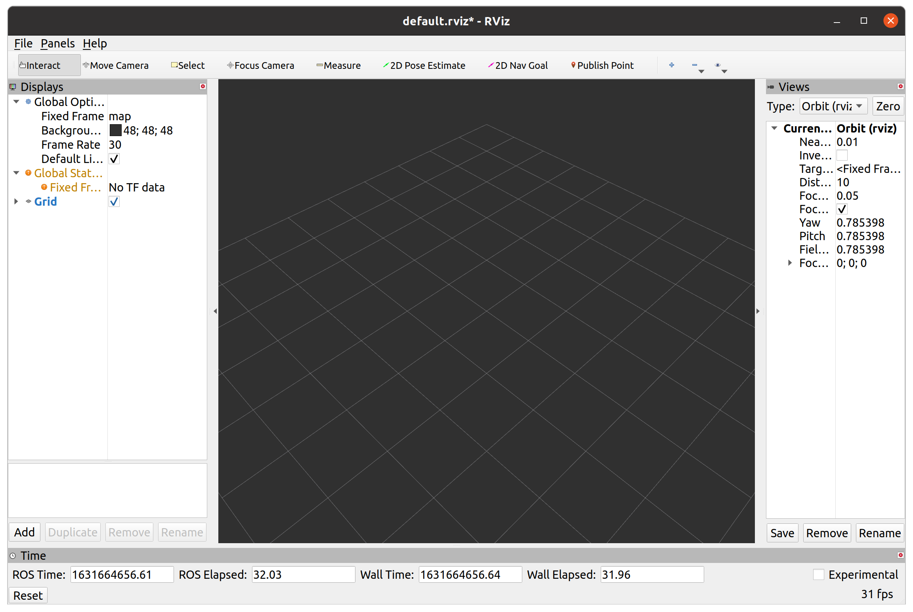

# 設計製作論実習3

## 第1回

千葉工業大学 上田 隆一

<br />

<p style="font-size:50%">
This work is licensed under a <a rel="license" href="http://creativecommons.org/licenses/by-sa/4.0/">Creative Commons Attribution-ShareAlike 4.0 International License</a>.
<a rel="license" href="http://creativecommons.org/licenses/by-sa/4.0/">
</a>
</p>

---

## 今日やること

* （見ていない人は）イントロダクションのビデオを見る
  * ビデオを見た人はWSLのインストールをしながら待つ
* Slackへの参加
* WSLのインストール


---

## ROSのセットアップ

Windows編

---

### WSLでのROS環境構築

* 使うツール
    * WSL: [Windows Subsystem for Linux](https://ja.wikipedia.org/wiki/Windows_Subsystem_for_Linux)
    * ROS: [robot operating system](http://wiki.ros.org/)
* 参考にしたサイト
    * WSL+ROS
        * [WSL(Windows Subsystem for Linux)でROSを動かす | naonaorange's blog](https://naonaorange.hatenablog.com/entry/2018/11/05/200715)
        * [WSL: Windows Subsystem for Linuxのインストールと設定 | demura.net](https://demura.net/lecture/15062.html)
        * [WSL: RvizやGazeboが起動しない | demura.net](https://demura.net/lecture/15304.html)
        * 注意: 参考になりますが、以後のスライドと設定が微妙に異なります。
    * SSH接続について
        * https://yuta0508.hatenablog.com/entry/2018/05/03/195616

---

### WSLのインストール

* Ubuntu 18.04 LTSをインストール（左図）
* 使えるようにシステムを設定（右図）


---

### ROSのインストール

* GitHub上のインストールスクリプトを利用
    * https://github.com/ryuichiueda/ros_setup_scripts_Ubuntu18.04_desktop

```
$ git clone https://github.com/ryuichiueda/ros_setup_scripts_Ubuntu18.04_desktop.git
$ cd ros_setup_scripts_Ubuntu18.04_desktop/
$ sudo apt update
$ sudo apt upgrade
$ ./locale.ja.bash
$ ./step0.bash
$ ./step1.bash
```

---

### 動作確認

```
$ source ~/.bashrc
$ roscore
... logging to /home/ueda/.ros/log/d26a0c78-b52f-11e9-a961-001c4252779e/roslaunch-1C7F-429.log
Checking log directory for disk usage. This may take awhile.
Press Ctrl-C to interrupt
Done checking log file disk usage. Usage is <1GB.

started roslaunch server http://localhost:49975/
ros_comm version 1.14.3


SUMMARY
========

PARAMETERS
 * /rosdistro: melodic
 * /rosversion: 1.14.3

NODES

auto-starting new master
process[master]: started with pid [439]
ROS_MASTER_URI=http://localhost:11311/

setting /run_id to d26a0c78-b52f-11e9-a961-001c4252779e
process[rosout-1]: started with pid [450]
started core service [/rosout]
```

* Windowsがネットワークのアクセスがどうのこうのと文句を言ってきたら「許可」で
* プログラムの終了は`Ctrl+C`で

---

### ワークスペースの作成

* ワークスペース: プログラム置き場です
```
$ cd
$ mkdir -p catkin_ws/src
$ cd catkin_ws/src
$ catkin_init_workspace
Creating symlink "/home/ueda/catkin_ws/...
$ cd ..
$ catkin_make
```

* 次いで`~/.bashrc`を編集
```
$ vi ~/.bashrc
・・・
source /opt/ros/melodic/setup.bash
source ~/catkin_ws/devel/setup.bash             #この行を追加
export ROS_MASTER_URI=http://localhost:11311
export ROS_HOSTNAME=localhost
・・・
$ source ~/.bashrc
$ cd ~/catkin_ws/
$ catkin_make
```

---

### CRANE-X7のROSパッケージを<br />インストール

```
$ cd ~/catkin_ws/src
$ git clone https://github.com/rt-net/crane_x7_ros.git
$ git clone https://github.com/roboticsgroup/roboticsgroup_gazebo_plugins.git
$ rosdep install -r -y --from-paths --ignore-src crane_x7_ros
・・・
$ ( cd ~/catkin_ws/ && catkin_make )
```

---

### X Window Systemのインストール

* X Window System: Unix系OSのGUIのシステム
    * データを受けて絵を受けるOSとは独立したプログラム
* プロトコルが決まっているのでXならなんでもいいけどここではXmingをインストール
    * [OSDNのXmingのページ](https://ja.osdn.net/projects/sfnet_xming/)から`Xming-6-9-0-31-setup.exe`をインストール
    * `Xming-fonts-7-7-0-10-setup.exe`もインストール
    * 指示は全部デフォルトのままでよいです

---

### X Window Systemのセットアップ

* Xmingが立ち上がっていることを確認

* `~/.bashrc`に設定を書く
```
・・・
export DISPLAY=localhost:0.0   #0.0は上の絵のポップアップで出てくる数字に合わせる
export LIBGL_ALWAYS_INDIRECT=0
export GAZEBO_IP=127.0.0.1
```
    * 一番下に書いておけばよいです

---

### RVizの動作確認

```
$ source ~/.bashrc
$ roscore &
（しばらく待つ）
$ rviz
```




---

### Gazeboの動作確認

* `~/.ignition/fuel/config.yaml`を編集
```
servers:
  -
    name: osrf
    url: https://api.ignitionrobotics.org #ignitionroboticsに
```
* CRANE-X7のサンプルを立ち上げる
```
$ roslaunch crane_x7_gazebo crane_x7_with_table.launch
```


---

### 不具合の証言

* すんなりいかない場合もあります
    * 上田研OB小池さんから
        * GAZEBOの動作確認の「`~/.ignition/fuel/config.yaml`を編集」のところで、ignitionフォルダが最初がなく、1度Gazeboを立上げたら生成された
        * 最初`crane_x7_with_table.launch`を起動させたらGazeboの画面がしばらく放置しても真っ黒のままだった。Ctrl+Cした後、`empty_world.launch`を立上げたら普通に表示されたので、もう一度`crane_x7_with_table.launch`を起動したら表示された
