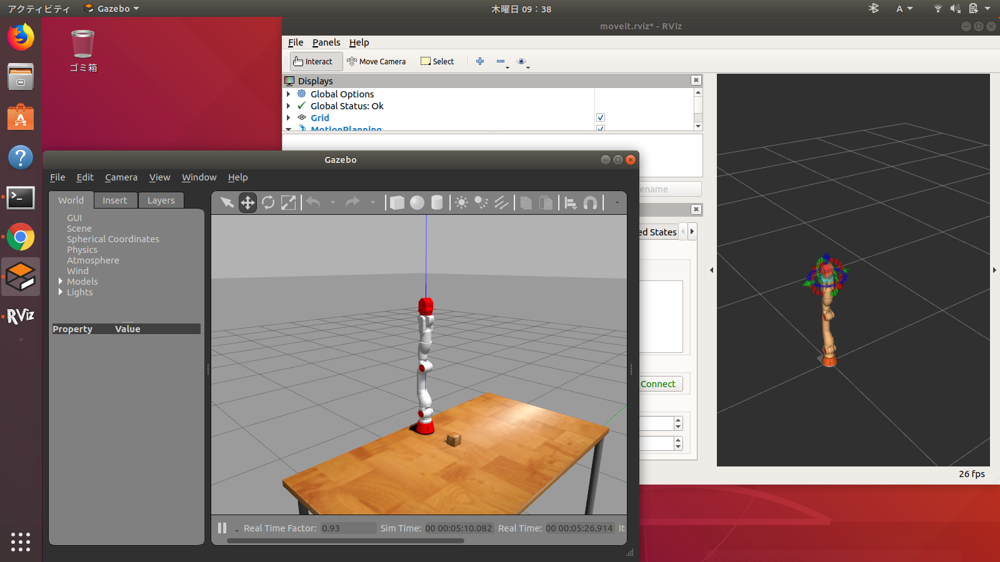
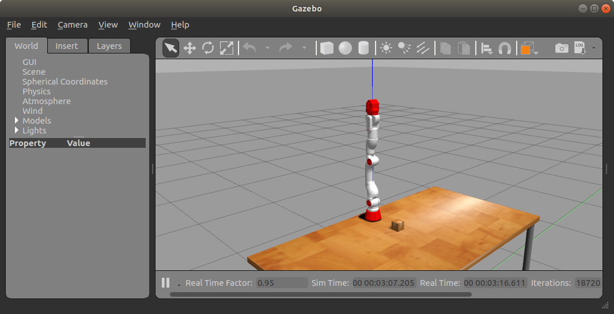

# 設計製作論実習3

## 第2回

千葉工業大学 上田 隆一

<br />

<p style="font-size:50%">
This work is licensed under a <a rel="license" href="http://creativecommons.org/licenses/by-sa/4.0/">Creative Commons Attribution-ShareAlike 4.0 International License</a>.
<a rel="license" href="http://creativecommons.org/licenses/by-sa/4.0/">
</a>
</p>

---

## 今日の内容

* Move It!を使う
* サンプルコードを動かす
    * CRANE-X7のROSパッケージ
    *     [README](https://github.com/rt-net/crane_x7_ros/blob/master/README.md)はこちら
        * 実機についての言及がありますが、まだ実機は扱いません

---

### 起動

```
$ roslaunch crane_x7_gazebo crane_x7_with_table.launch
```



* 左下: Gazebo
    * シミュレータ
* 右上: RViz 
    * ROSのモニタリング/コントロールツール

---

### <span style="text-transform:none">MoveIt!</span>の操作

* こちらの資料を使わせていただきましょう
    * [マニピュレータの制御とMoveIt!の利用](https://gbiggs.github.io/ros_moveit_rsj_tutorial/manipulators_and_moveit.html)
        * [ハードウェアのロボットを制御](https://gbiggs.github.io/ros_moveit_rsj_tutorial/manipulators_and_moveit.html#%E3%83%8F%E3%83%BC%E3%83%89%E3%82%A6%E3%82%A7%E3%82%A2%E3%81%AE%E3%83%AD%E3%83%9C%E3%83%83%E3%83%88%E3%82%92%E5%88%B6%E5%BE%A1)のRViz上での操作から順番に操作方法を確認
        * ちょっとボタンやプルダウンの項目が違うので注意
* やること
    * ランダムに姿勢を選んで計画->実行

---

## サンプルコードを動かす

---

### 準備

* Gazeboを立ち上げておく
```
$ roslaunch crane_x7_gazebo crane_x7_with_table.launch
```

* サンプルプログラムのディレクトリに移動
```
$ cd ~/catkin_ws/src/crane_x7_ros/crane_x7_examples/scripts/
```

---

### ハンドの開閉

* [gripper_action_example.py](https://github.com/rt-net/crane_x7_ros/blob/master/crane_x7_examples/scripts/gripper_action_example.py)
    * ハンドを開いて閉じる
    * 動かすときは`rosrun`を用いる（下のコマンド）

```
$ rosrun crane_x7_examples gripper_action_example.py 
```

---

### ハンドが開閉する仕組み

* ROSのアクションという仕組みを使用
    * サンプルプログラムと、裏で動いているシステム側のプログラム（システムプログラムと呼ぶ）が連携して動作
        * サンプルプログラム: ある動作をシステムプログラムに依頼して待つ
        * システムプログラム: ロボットに動きを伝える
    * このような構成をとることでGazeboでも実機でも同じサンプルで動く
        * ROSの利点
* [解説つきコード](https://github.com/ryuichiueda/my_crane_x7_samples/blob/master/scripts/gripper_action_example.py)

---

### 決まった姿勢への遷移

* [pose_groupstate_example.py](https://github.com/rt-net/crane_x7_ros/blob/master/crane_x7_examples/scripts/pose_groupstate_example.py)
    * [SRDFファイル](https://github.com/rt-net/crane_x7_ros/blob/master/crane_x7_moveit_config/config/crane_x7.srdf)に記述されているアームの姿勢を読み込んで姿勢を変更
        * `group`: リンクやジョイントをグループ化
        * `group_state`: 各ジョイントの角度を指定してロボットの特定の姿勢を作ったもの
        * `virtual_joint`: 環境にロボットを固定する仮想ジョイント
        * `distable_collisions`: 衝突判定を無効に
* [解説つきコード](https://github.com/ryuichiueda/my_crane_x7_samples/blob/master/scripts/pose_groupstate_example.py)

---

### 自身のROSパッケージを作る

* ワークスペース（`catkin_ws/src`）にROSのパッケージを作る

```
$ cd ~/catkin_ws/src/
$ catkin_create_pkg hand_test rospy  # hand_testというパッケージを作成
$ cd hand_test/                      # 作ったパッケージに移動
### 中身の確認 ###
$ ls
CMakeLists.txt  package.xml  src
```

---

### サンプルのスクリプトを置く

* 手順
  * `scripts`というディレクトリを作成
  * `pose_groupstate_example.py`をコピーして置く
    * ライセンスの確認を
  * コードの1行目を変更
    * `#!/usr/bin/env python`を`#!/usr/bin/env python3`に変更

```
$ mkdir scripts
$ cd scripts/
$ wget https://raw.githubusercontent.com/rt-net/crane_x7_ros/master/crane_x7_examples/scripts/pose_groupstate_example.py
$ chmod +x pose_groupstate_example.py
$ vi pose_groupstate_example.py
・・・1行目を編集・・・
```

---

### 自身のROSパッケージを動かす

* 動かしてみましょう
  * 注意: `rosrun`では自分のパッケージを指定

```
$ ( cd ~/catkin_ws && catkin_make ) 
$ source ~/.bashrc
（別の端末を開いて）$ roslaunch crane_x7_gazebo crane_x7_with_table.launch 
$ rosrun hand_test pose_groupstate_example.py 
```

---

### <span style="text-transform:none">GitHub</span>へアップ

* `package.xml`を編集してライセンスとauthorを整備
* `crane_x7_ros`の`LICENSE`ファイルをコピー
* アップする手順は動画で

```xml
$ cd ~/catkin_ws/src/hand_test/
$ vi package.xml
<?xml version="1.0"?>
<package format="2">
  <name>hand_test</name>
  <version>0.0.0</version>
  <description>The hand_test package</description>

  <maintainer email="ueda@todo.todo">ueda</maintainer>

  <license>NON-COMMERCIAL LICENSE AGREEMENT</license>

  <author email="tiryoh@gmail.com">Daisuke Sato</author>
  <author email="nomura@rt-net.jp">Hiroyuki Nomura</author>

  <buildtool_depend>catkin</buildtool_depend>
  <build_depend>rospy</build_depend>
  <build_export_depend>rospy</build_export_depend>
  <exec_depend>rospy</exec_depend>

</package>
```

---

### 発展課題

* コードやSRDFなどをいじってロボットに所定の動きをさせてみましょう。
  * 可能ならSRDFなどを自身のリポジトリへ引っ越し 


今回は以上です。
